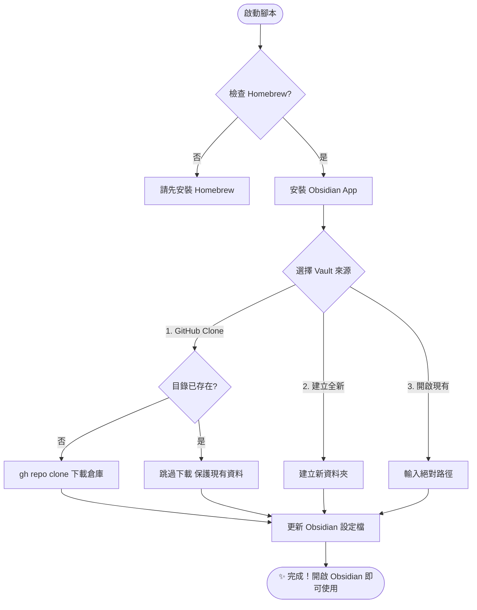

# 💎 Obsidian & GitHub 智慧連動手冊

本專案透過 `setup-obsidian.sh` 腳本，協助使用者自動化部署 Obsidian 筆記環境 (Vault)，並與 GitHub 倉庫進行智慧連動。本腳本不僅負責軟體安裝，更提供自動化的設定檔路徑綁定，實現開箱即用的體驗。

---

## 📊 部署邏輯圖 (Deployment Logic)



---

## 🛠️ 核心功能說明

### 1. 智慧路徑保護 (Smart Path Protection)
若選擇從 GitHub Clone，腳本會自動檢查目標路徑（預設為 `~/Documents/倉庫名稱`）是否已存在。
- **保護機制**：若目錄已存在，腳本將**跳過下載步驟**以防止覆蓋本機現有資料，並直接進行 Obsidian 設定檔綁定。
- **重新下載**：若需重新下載雲端資料，請先手動刪除或重新命名現有的本機資料夾。

### 2. GitHub CLI (gh) 整合
腳本整合了 GitHub CLI 工具，簡化認證流程：
- 自動偵測登入狀態，必要時引導使用者執行 `gh auth login` 進行認證。
- 支援透過倉庫名稱（例如 `s813082/barry_vault`）直接進行同步，無需手動輸入完整 URL。

### 3. 自動路徑綁定 (Auto Configuration)
腳本會自動修改 Obsidian 的內部設定檔 (`obsidian.json`)，將指定的 Vault 路徑直接寫入。使用者完成腳本執行後，開啟 Obsidian 即可直接看到並進入筆記倉庫，無需手動點選「Open folder as vault」。

---

## 🚀 操作步驟

### 步驟 1：啟動連動程序
於專案根目錄執行：
```bash
./setup-obsidian.sh
```

### 步驟 2：選擇筆記來源
腳本提供以下四種模式：
1. **GitHub 倉庫**: 適用於在新環境部署現有的 GitHub 筆記庫。
2. **建立全新**: 於本機建立全新的筆記資料夾。
3. **開啟現有**: 關聯本機已存在的筆記目錄。
4. **暫不設定**: 僅完成軟體安裝，跳過 Vault 配置。

### 步驟 3：完成部署
根據螢幕提示完成輸入。看到「🎉 Obsidian 筆記環境部署完成！」提示後，即可開啟 Obsidian 開始工作。

---

## 📜 技術細節
- **設定檔路徑**: `~/Library/Application Support/obsidian/obsidian.json`
- **預設存放目錄**: `~/Documents/`
- **系統需求**: `git`, `brew`, `gh` (GitHub CLI)
- **支援平台**: macOS (主要測試平台)
