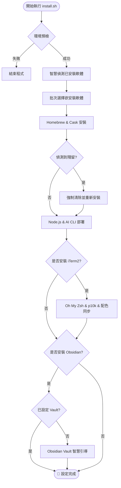

<p align="center">
  
</p>

# 🚀 init-my-workflow

<p align="center">
  <a href="https://github.com/s813082/init-my-workflow/releases"></a>
  <a href="LICENSE"></a>
  <a href="https://github.com/s813082/init-my-workflow/stargazers"></a>
  <a href="https://www.apple.com/macos"></a>
  <a href="https://deepwiki.com/s813082/init-my-workflow"></a>
</p>

[English](#english) | [中文](#中文)

---

## 🏗️ 工作流程 (Workflow Visualization)



---

<a name="english"></a>
## 🌟 English | Ready for Battle!

An automated macOS initialization suite designed to get you up and running in record time. Say goodbye to manual setups! 🚀

### ✨ Key Highlights
- **Smart System Scan**: Instantly identifies what's already installed and what's missing.
- **Efficient Batch Setup**: Choose all your tools at once, then sit back while it handles the rest.
- **Self-Healing Logic**: Automatically cleans up broken Homebrew links before re-installing.
- **Obsidian Intelligence**: Automated vault setup with GitHub sync and `obsidian.json` injection.
- **iTerm2 Perfection**: Conditional Zsh & p10k configuration only when iTerm2 is present.

### 📦 The Powerhouse Toolkit

#### 🛡️ Core Infrastructure
- **Browsers**: Google Chrome
- **Terminal**: iTerm2 (with Powerlevel10k & Zsh-Autosuggestions)
- **Utilities**: Rectangle, IINA, AlDente, Keka, Stats
- **Knowledge**: Obsidian (with automated Git Vault setup)

#### 💻 Dev Power
- **Editors**: VSCode, Sublime Text
- **API/DB**: Postman, DBeaver
- **Runtime**: Node.js & AI CLI (Gemini & Copilot)

### ⚡ Quick Start
```bash
git clone https://github.com/s813082/init-my-workflow.git ~/Documents/init-my-workflow
cd ~/Documents/init-my-workflow && chmod +x install.sh && ./install.sh
```

---

<a name="中文"></a>
## 🌟 中文 | 熱血工作流啟動！

這是一套專為 macOS 設計的自動化初始化工具包，一鍵建立最強開發環境！🚀

### ✨ 核心亮點
- **智慧環境偵測**: 精準識別已安裝軟體，避免重複安裝。
- **高效批次選擇**: 安裝過程全自動，無需反覆確認。
- **註冊表自癒**: 完美解決「軟體已刪但紀錄殘留」的 Homebrew 痛點。
- **Obsidian 智慧連動**: 自動化 Vault 設定、GitHub 同步與配置文件注入。
- **iTerm2 精準投放**: 僅在需要時部署 Oh My Zsh 與美化設定。

### 🛠️ 一鍵安裝指令
```bash
git clone https://github.com/s813082/init-my-workflow.git ~/Documents/init-my-workflow
cd ~/Documents/init-my-workflow && chmod +x install.sh && ./install.sh
```

---

## 📜 任務紀錄 (Mission Logs)

- **v3.4** - 📊 流程視覺化：新增 Mermaid 流程圖，重構 README 結構。
- **v3.3** - 💎 Obsidian 智慧連動：新增 Vault 自動化設定與配置文件注入。
- **v3.2** - ⚡️ 旗艦版網頁：視覺進化與 AI 雙護法獨立展示。

## 📄 授權 (License)
MIT
