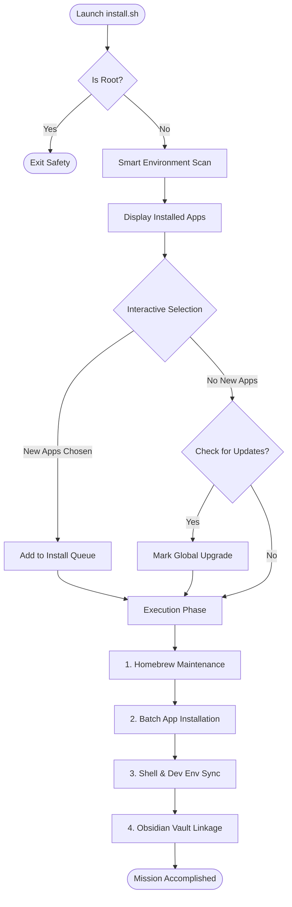
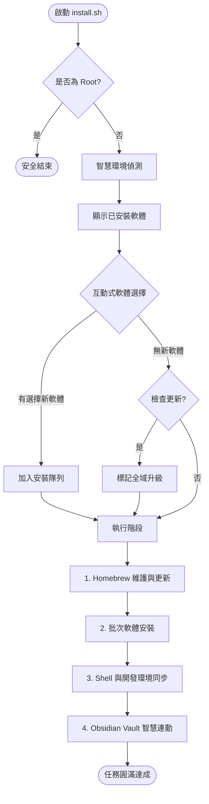

<p align="center">
  
</p>

# 🚀 init-my-workflow

<p align="center">
  <a href="https://github.com/s813082/init-my-workflow/releases"></a>
  <a href="LICENSE"></a>
  <a href="https://github.com/s813082/init-my-workflow/stargazers"></a>
  <a href="https://www.apple.com/macos"></a>
</p>

---

## 🌟 English | Ready for Battle!

An automated macOS initialization suite designed to get you up and running in record time. Say goodbye to manual setups! 🚀

### ✨ Key Highlights
- **Smart System Scan**: Instantly identifies what's already installed and what's missing.
- **Efficient Batch Setup**: Choose all your tools at once, then sit back while it handles the rest.
- **Self-Healing Logic**: Automatically cleans up broken Homebrew links before re-installing.
- **Permission Guard**: Validates system directory access before it even starts.
- **Total Peace of Mind**: Zero risk of overwriting your hard work—backups are created automatically.

<details>
<summary>📊 <b>Show Workflow Logic (Mermaid)</b></summary>


</details>

### 📦 The Powerhouse Toolkit

#### 🛡️ Core Infrastructure
- [Google Chrome](https://www.google.com/chrome/) - The fastest, most reliable browser for browsing and development.
- [iTerm2](https://iterm2.com/) - The legendary terminal replacement for macOS with endless customization.
- [Rectangle](https://rectangleapp.com/) - Move and resize windows in macOS with keyboard shortcuts.
- [IINA](https://iina.io/) - The modern media player for macOS, built for design and speed.
- [AlDente](https://github.com/davidwernhart/AlDente) - Protect your MacBook battery by limiting charging capacity.
- [Obsidian](https://obsidian.md/) - A powerful knowledge base that works on top of a local folder of plain text files.

#### 💻 Dev Power
- [VSCode](https://code.visualstudio.com/) - The world's most popular code editor, supercharged with extensions.
- [Postman](https://www.postman.com/) - Simplify every step of the API lifecycle and streamline collaboration.
- [DBeaver](https://dbeaver.io/) - Multi-platform database tool for developers, database administrators, and analysts.
- [Royal TSX](https://www.royalapps.com/ts/mac/features) - The perfect tool for system engineers and IT professionals who need to access remote systems.
- [Node.js & AI CLI](https://nodejs.org/) - Integrated with Gemini and Copilot CLI to supercharge your terminal with AI.

#### 🚀 Boosters & Social
- [Bitwarden](https://bitwarden.com/) - The easiest and safest way for individuals and teams to store and share sensitive data.
- [Tailscale](https://tailscale.com/) - A zero config VPN that installs on any device in minutes.
- [Stats](https://github.com/exelban/stats) - macOS system monitor in your menu bar.
- [Keka](https://www.keka.io/) - The macOS file archiver, store more, share with privacy.
- [Spotify](https://www.spotify.com/) - The best music streaming for your deep focus coding sessions.
- [Telegram](https://telegram.org/) - Fast and secure desktop messaging app.

### ⚡ One-Line Magic
```bash
git clone https://github.com/s813082/init-my-workflow.git ~/Documents/init-my-workflow
sudo chown -R $(whoami) /usr/local/share/man/man8 && cd ~/Documents/init-my-workflow && chmod +x install.sh && ./install.sh
```

<br>

## 🌟 中文 | 熱血工作流啟動！

這是一套專為 macOS 設計的自動化初始化工具包，旨在讓您換新機時不再手忙腳亂，一鍵建立最強開發環境！🚀

### ✨ 核心亮點
- **智慧環境偵測**: 自動掃描實體目錄與註冊表，精準識別已安裝軟體。
- **高效批次選擇**: 一次性選好所有軟體，安裝過程不再需要停下來回覆詢問。
- **註冊表自癒同步**: 偵測到「軟體已刪但紀錄殘留」時，會自動清除舊紀錄並重新乾淨安裝。
- **權限自動防禦**: 執行前自動檢查並修復常見的 Homebrew 寫入權限問題。
- **無痛設定遷移**: 自動備份現有的 `.zshrc`，讓您的舊設定永遠有一份保險。

<details>
<summary>📊 <b>顯示工作流邏輯圖 (Mermaid)</b></summary>


</details>

### 📦 包含軟體清單

#### 🛡️ 基礎核心 (Core Infrastructure)
- [Google Chrome](https://www.google.com/chrome/) - 全球最熱門的瀏覽器，查資料與網頁開發的黃金標配。
- [iTerm2](https://iterm2.com/) - macOS 最強終端機替代品，支援分頁、美化與強大的自定義功能。
- [Rectangle](https://rectangleapp.com/) - 極簡視窗分割管理工具，讓桌面空間配置一秒就緒。
- [IINA](https://iina.io/) - 現代化全能影音播放器，介面美觀、效能流暢，與 macOS 深度整合。
- [AlDente](https://github.com/davidwernhart/AlDente) - 精準限制電池充電上限，大幅延長 MacBook 電池健康度。
- [Obsidian](https://obsidian.md/) - 您專屬的第二大腦筆記系統，支援雙向連結與強大的插件生態。

#### 💻 專業開發 (Development Power)
- [VSCode](https://code.visualstudio.com/) - 開發者人手一套的程式碼編輯器，具備無窮無盡的擴充功能。
- [Postman](https://www.postman.com/) - 業界標準的 API 開發與測試工具，大幅提升前後端串接效率。
- [DBeaver](https://dbeaver.io/) - 多功能資料庫管理工具，一個介面搞定所有主流資料庫。
- [Royal TSX](https://www.royalapps.com/ts/mac/features) - 專業的遠端系統管理工具，支援多種協定，是 IT 與系統工程師的必備良伴。
- [Node.js & AI CLI](https://nodejs.org/) - 內建 Gemini 與 Copilot CLI，讓 AI 助手常駐您的終端機。

#### 🚀 效率與社群 (Boosters & Social)
- [Bitwarden](https://bitwarden.com/) - 開源且安全的密碼管理工具，跨平台同步讓您的數位資產萬無一失。
- [Tailscale](https://tailscale.com/) - 基於 WireGuard 的零設定 VPN 工具，幾分鐘內即可建立安全的私人網路。
- [Stats](https://github.com/exelban/stats) - 置於選單列的系統監控，隨時掌握 CPU、記憶體與網路動態。
- [Keka](https://www.keka.io/) - macOS 必備萬能解壓縮軟體，完美解決壓縮檔文字亂碼問題。
- [Spotify](https://www.spotify.com/) - 提供海量高品質音樂，為您的寫 Code 時光注入動能。
- [Telegram](https://telegram.org/) - 隱私、快速且支援跨平台的現代化通訊平台。

### 🛠️ 一鍵安裝指令
```bash
git clone https://github.com/s813082/init-my-workflow.git ~/Documents/init-my-workflow
sudo chown -R $(whoami) /usr/local/share/man/man8 && cd ~/Documents/init-my-workflow && chmod +x install.sh && ./install.sh
```

---

## ❓ 您的疑問，我們來解答 (FAQ)

**Q: 執行 `sudo chown` 安全嗎？**
A: 這只是將 `/usr/local` 相關目錄的所有權轉回給您目前的帳號，這是 Homebrew 運作的標準做法，完全不會影響系統核心安全喔！

**Q: 我原本的 Zsh 設定會不見嗎？**
A: 別擔心！腳本會偵測到您的舊 `.zshrc` 並將它重新命名為 `.zshrc.bak`。您的回憶與設定都會被好好保護著！

**Q: 如果安裝失敗了怎麼辦？**
A: 腳本具備冪等性設計，您可以隨時重新執行。只要網路通暢，它會自動從斷掉的地方繼續前進！

## 📄 授權 (License)
MIT

---

## 📜 任務紀錄 (Mission Logs)

- **v3.4** - 🛠️ 工具擴充：新增 Royal TSX (遠端管理)、Bitwarden (密碼管理) 與 Tailscale (網格 VPN)。
- **v3.3** - 💎 Obsidian 智慧連動：新增 Vault 自動化設定流程，支援本機/遠端同步與推送測試。
- **v3.2** - ⚡️ 旗艦版網頁：加入深淺色切換、官方 Icon 補全、AI 雙護法獨立展示。
- **v3.1** - 🤖 AI 強勢介入：加入 Gemini CLI 與 GitHub Copilot CLI 選配安裝。
- **v3.0** - 🎨 視覺進化：建立賽博龐克風格 GitHub Pages，導入 Simple Icons 官方標標。
- **v2.5** - 🛠️ 自癒能力：實作實體路徑偵測，自動清理 Homebrew 殘留紀錄。
- **v2.0** - 🔍 智慧掃描：重構互動邏輯，改為批次詢問，並全面繁體中文化。
- **v1.0** - 🚀 初始啟動：建立基礎 Brewfile 與一鍵連結設定檔之腳本。
